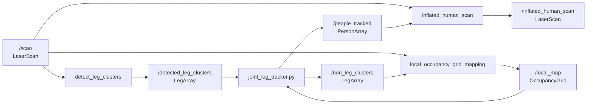

# Detector y seguimiento de personas con LiDAR 2D

Este documento describe el estado actual del proyecto `ros2_leg_detector`: que problema resuelve, como se organizan sus nodos, que mensajes intercambian, que formulas utiliza cada etapa y como se obtiene una posicion estable de las personas a partir de un escaneo LiDAR 2D.

## 1. Problema y solucion

Un LiDAR 2D no observa directamente una persona completa. En cada barrido solo devuelve puntos donde el haz encontro una superficie. Por tanto, una persona puede aparecer como uno o dos grupos de puntos correspondientes a sus piernas, con ruido, oclusiones y medidas perdidas.

La solucion implementada es un pipeline de cuatro etapas:

1. Convertir cada medida válida del `LaserScan` a un punto cartesiano.
2. Separar los puntos en clusters conectados y clasificar la geometría de cada cluster con un bosque aleatorio.
3. Asociar las detecciones entre barridos con un filtro de Kalman, emparejar dos piernas y publicar una persona.
4. Usar las personas detectadas para excluirlas del mapa local y, opcionalmente, inflar su posicion en otro `LaserScan`.



El detector trabaja en un marco fijo, normalmente `laser` o `base_scan`. Las transformaciones entre marcos se resuelven mediante TF2. Los mensajes sincronizados se procesan juntos para evitar comparar un escaneo con una posicion de persona de otro instante.

## 2. Estructura del repositorio

| Ruta | Responsabilidad |
| --- | --- |
| `leg_detector/src/laser_processor.cpp` | Extrae puntos validos y calcula clusters conectados. |
| `leg_detector/include/leg_detector/laser_processor.h` | Tipos `Sample`, `SampleSet` y `ScanProcessor`. |
| `leg_detector/src/cluster_features.cpp` | Calcula los descriptores geometricos de cada cluster. |
| `leg_detector/include/leg_detector/cluster_features.h` | Interfaz del extractor de caracteristicas. |
| `leg_detector/src/detect_leg_clusters.cpp` | Clasificacion Random Forest, TF y publicacion de piernas. |
| `leg_detector/scripts/joint_leg_tracker.py` | Asociacion temporal, Kalman y agrupacion de piernas en personas. |
| `leg_detector/src/local_occupancy_grid_mapping.cpp` | Mapa local probabilistico de obstaculos no humanos. |
| `leg_detector/src/inflated_human_scan.cpp` | Proyeccion de un radio alrededor de cada persona sobre el LiDAR. |
| `leg_detector/config/trained_leg_detector_res=0.33.yaml` | Bosque aleatorio entrenado con 17 variables. |
| `leg_detector/launch/` | Escenarios de rosbag, Gazebo Classic y TurtleBot3 House. |
| `leg_detector_msgs/msg/` | Mensajes `Leg`, `LegArray`, `Person` y `PersonArray`. |

## 3. Interfaces ROS 2

### 3.1 Mensajes propios

`Leg.msg` contiene:

```text
geometry_msgs/Point position
float32 confidence
```

`LegArray.msg` contiene una cabecera y una lista de piernas:

```text
std_msgs/Header header
Leg[] legs
```

`Person.msg` contiene la pose y un identificador estable durante la vida del track:

```text
geometry_msgs/Pose pose
uint32 id
```

`PersonArray.msg` contiene:

```text
std_msgs/Header header
Person[] people
```

### 3.2 Topicos principales

| Topico | Tipo | Productor | Consumidores |
| --- | --- | --- | --- |
| `/scan` | `sensor_msgs/LaserScan` | Sensor o simulador | Detector, mapa, inflador |
| `/detected_leg_clusters` | `leg_detector_msgs/LegArray` | Detector | Tracker |
| `/people_tracked` | `leg_detector_msgs/PersonArray` | Tracker | Inflador |
| `/non_leg_clusters` | `leg_detector_msgs/LegArray` | Tracker | Mapa |
| `/local_map` | `nav_msgs/OccupancyGrid` | Mapa | Tracker |
| `/inflated_human_scan` | `sensor_msgs/LaserScan` | Inflador | Consumidor externo opcional |
| `/visualization_marker` | `visualization_msgs/Marker` | Detector y tracker | RViz |

El nombre `non_leg_clusters` es historico. En la implementacion se usa para enviar los clusters que no fueron asociados a una persona, de modo que el mapa pueda identificar que medidas debe tratar como humanas y no como obstaculos.

## 4. Preprocesamiento del escaneo

### 4.1 De coordenadas polares a cartesianas

Una medida `ranges[i]` se acepta solo si cumple:

$$
r_{min} < r_i < r_{max}.
$$

Para el indice $i$, el angulo es:

$$
\theta_i = \mathrm{angle\_min} + i\,\mathrm{angle\_increment}.
$$

El punto en el marco del sensor es:

$$
x_i = r_i\cos(\theta_i),\qquad y_i = r_i\sin(\theta_i).
$$

Las medidas invalidas se descartan en `Sample::Extract`. Cada muestra conserva su indice original, lo que permite volver a localizarla en el array `ranges`.

### 4.2 Segmentacion por conectividad

Inicialmente todos los puntos validos estan en un conjunto. `splitConnected(thresh)` realiza una busqueda en anchura: dos muestras se conectan si su distancia euclidea es menor que el umbral $\tau$:

$$
d(p_i,p_j)=\sqrt{(x_i-x_j)^2+(y_i-y_j)^2}<\tau.
$$

El algoritmo no compara todos los puntos. Estima cuantos indices angulares pueden estar dentro del umbral alrededor de una muestra:

$$
n_{ang}\approx \frac{\arcsin(\tau/r_i)}{\Delta\theta},
$$

y explora solo ese vecindario ordenado por indice. El valor usado normalmente es $\tau=0.13\,m$.

Despues se eliminan los clusters con menos de tres puntos por defecto. Esto reduce detecciones producidas por ruido aislado.

El centro del cluster se calcula como la media:

$$
\bar{x}=\frac{1}{N}\sum_{i=1}^{N}x_i,
\qquad
\bar{y}=\frac{1}{N}\sum_{i=1}^{N}y_i.
$$

## 5. Clasificacion de clusters como piernas

### 5.1 Caracteristicas geometricas

`ClusterFeatures::calcClusterFeatures` genera 17 variables para cada cluster. En el mismo orden que el clasificador:

1. Numero de puntos $N$.
2. Desviacion respecto al centroide:
   $$s=\sqrt{\frac{1}{N-1}\sum_i((x_i-\bar{x})^2+(y_i-\bar{y})^2)}.$$
3. Desviacion media respecto a la mediana geometrica aproximada.
4. Anchura entre el primer y el ultimo punto:
   $$w=\|p_{first}-p_{last}\|.$$
5. Linealidad, obtenida mediante SVD de los puntos centrados. Es la suma de cuadrados de la componente transversal.
6. Circularidad, suma del error cuadratico de los puntos respecto al circulo ajustado.
7. Radio $r_c$ del circulo ajustado.
8. Longitud del contorno, suma de las distancias entre muestras consecutivas.
9. Regularidad del contorno, basada en la desviacion de esas longitudes.
10. Curvatura media, calculada a partir del area de triangulos consecutivos.
11. Diferencia angular media entre segmentos consecutivos.
12. Diferencia angular inscrita media (`iav`).
13. Desviacion de la diferencia angular inscrita (`std_iav`).
14. Distancia del cluster al laser:
    $$d=\sqrt{\tilde{x}^{2}+\tilde{y}^{2}},$$
    donde $(\tilde{x},\tilde{y})$ es la mediana de las coordenadas.
15. Distancia normalizada $d/N$.
16. Indicador de oclusion derecha.
17. Indicador de oclusion izquierda.

La linealidad usa la factorizacion SVD de la matriz centrada $P$. La circularidad ajusta el sistema:

$$
\begin{bmatrix}
-2x_1 & -2y_1 & 1\\
\vdots & \vdots & \vdots\\
-2x_N & -2y_N & 1
\end{bmatrix}
\begin{bmatrix}x_c\\y_c\\c\end{bmatrix}
=
\begin{bmatrix}
-(x_1^2+y_1^2)\\
\vdots\\
-(x_N^2+y_N^2)
\end{bmatrix}.
$$

El radio se obtiene con:

$$
r_c=\sqrt{x_c^2+y_c^2-c}.
$$

La oclusion se estima mirando el punto anterior al primer punto y el posterior al ultimo. Si el cluster esta mas cerca del sensor que el punto vecino, se considera que puede ocultar una parte del objeto.

### 5.2 Random Forest

El fichero YAML contiene un `cv::ml::RTrees` con:

- 100 arboles.
- 6290 muestras de entrenamiento.
- 17 variables.
- Dos clases: no pierna y pierna.

Para cada cluster, el detector calcula los votos positivos y negativos. La confianza publicada es:

$$
P(leg\mid f)=\frac{V_{+}}{V_{+}+V_{-}},
$$

donde $f$ es el vector de 17 caracteristicas. Si $P$ supera `detection_threshold`, el cluster se convierte en un `Leg`.

El detector limita el procesamiento a clusters con:

$$
\sqrt{x^2+y^2}<\text{max\_detect\_distance}.
$$

Las piernas se ordenan de menor a mayor distancia al laser. Se publican en el marco fijo y se representan en RViz como esferas de 13 cm.

## 6. Seguimiento temporal y formacion de personas

El nodo `joint_leg_tracker.py` resuelve dos problemas: evitar que una deteccion cambie de identidad entre barridos y decidir cuando dos tracks representan las piernas de una misma persona.

### 6.1 Estado y modelo de movimiento

Cada objeto mantiene el estado:

$$
\mathbf{x}_k=[x_k, y_k, v_{x,k}, v_{y,k}]^T.
$$

Con $\Delta t=1/f$ y frecuencia de escaneo $f$, el modelo de velocidad constante es:

$$
\mathbf{x}_{k+1}=F\mathbf{x}_k+\mathbf{w}_k,
$$

$$
F=
\begin{bmatrix}
1&0&\Delta t&0\\
0&1&0&\Delta t\\
0&0&1&0\\
0&0&0&1
\end{bmatrix}.
$$

La observacion disponible es solo la posicion:

$$
\mathbf{z}_k=H\mathbf{x}_k+\mathbf{v}_k,
\qquad
H=\begin{bmatrix}1&0&0&0\\0&1&0&0\end{bmatrix}.
$$

Cuando un objeto no se observa, el filtro recibe una observacion enmascarada y predice sin correccion. Esto permite atravesar oclusiones breves.

### 6.2 Asociacion de detecciones

La asociacion usa la distancia de Mahalanobis entre una deteccion $z$ y un track $t$:

$$
d_M(z,t)=\sqrt{\frac{(x_z-x_t)^2+(y_z-y_t)^2}{\sigma_t^2+\sigma_{obs}^2}}.
$$

Solo se consideran coincidencias dentro de la puerta estadistica definida por `confidence_percentile`. La asignacion global se resuelve con el algoritmo hungaro (`linear_sum_assignment`), minimizando el coste total.

La confianza y la ocupacion libre se suavizan entre la pista anterior y la nueva observacion:

$$
c_t\leftarrow0.95c_t+0.05c_{obs},
$$

$$
f_t\leftarrow0.8f_t+0.2f_{obs}.
$$

Un track se elimina cuando su confianza cae por debajo de `confidence_threshold_to_maintain_track` o cuando su covarianza supera `max_std^2`.

### 6.3 Emparejamiento de piernas

Se mantienen pares candidatos de tracks. Un par se descarta si:

- La separacion supera `max_leg_pairing_dist`.
- Alguna pista fue eliminada.
- Las dos pistas ya son personas.
- Alguna confianza es demasiado baja.

Para crear una persona se exige ademas que las dos pistas se hayan observado en el barrido actual, que hayan recorrido conjuntamente mas de `dist_travelled_together_to_initiate_leg_pair` y que al menos una este en espacio libre. La posicion de la persona es la media de las dos piernas:

$$
x_p=\frac{x_1+x_2}{2},
\qquad
y_p=\frac{y_1+y_2}{2}.
$$

En barridos posteriores una persona se duplica internamente durante la asociacion para poder recibir observaciones de sus dos piernas. Si solo se observa una pierna, la otra posicion se conserva mediante el filtro de Kalman.

La orientacion publicada se obtiene de la velocidad:

$$
\psi=\operatorname{atan2}(v_y,v_x).
$$

El resultado se publica como `PersonArray`, con ID, pose, marcador corporal, direccion de movimiento y elipse de incertidumbre en RViz.

## 7. Mapa local de ocupacion

`local_occupancy_grid_mapping` crea una cuadricula cuadrada centrada inicialmente en el laser. Sus valores se almacenan internamente en log-odds, no directamente como porcentajes.

### 7.1 Geometria de la cuadricula

Con resolucion $r$ y `width` celdas por lado, la celda $(i,j)$ tiene coordenadas aproximadas:

$$
x_{ij}=x_c+(i-W/2)r,
\qquad
y_{ij}=y_c+(j-W/2)r.
$$

Para cada celda se calcula su distancia y angulo respecto al laser y se selecciona el haz mas cercano.

### 7.2 Actualizacion probabilistica

La conversion entre probabilidad y log-odds es:

$$
L(p)=\log\left(\frac{p}{1-p}\right),
\qquad
p(L)=\frac{e^L}{1+e^L}.
$$

Cada medida aporta una probabilidad de observacion $m$ y la actualizacion es:

$$
L_{k}=L_{k-1}+L(m_k)-L(p_0),
$$

con saturacion entre `MIN_PROB=0.001` y `MAX_PROB=0.999`.

Los valores usados son:

| Situacion | Probabilidad |
| --- | ---: |
| Obstaculo | `0.7` |
| Espacio libre | `0.4` |
| Desconocido | `0.5` |

Una celda se marca como obstaculo si esta cerca del extremo medido por el haz, el rango es valido y el cluster no corresponde a una persona. La region anterior al obstaculo se marca como espacio libre. Si el haz es infinito, solo se confia en el espacio libre hasta `reliable_inf_range`.

### 7.3 Exclusion de personas

El mapa transforma las posiciones recibidas en `non_leg_clusters` al marco del laser. Vuelve a segmentar el escaneo y compara el centro de cada cluster con esas posiciones. Si la distancia es menor que $0.1\,m$, ese cluster se identifica como humano y no se marca como obstaculo.

Por eso el mapa resuelve el problema de que una persona seguida quede incorporada permanentemente al mapa como obstaculo estatico.

Cuando el laser se aleja mas de `shift_threshold` del centro actual, la cuadricula se desplaza en unidades enteras de resolucion. Las celdas que entran en la cuadricula se inicializan como libres o desconocidas segun `unseen_is_free_space`.

## 8. Inflado de personas

`inflated_human_scan` sincroniza `/scan` y `/people_tracked` por timestamp. Para cada persona situada en $(x_H,y_H)$ calcula:

$$
d_H=\sqrt{x_H^2+y_H^2},
\qquad
\alpha=\operatorname{atan2}(y_H,x_H).
$$

Si el radio de inflado es $R$ y $d_H>R$, el angulo tangente es:

$$
\theta_t=\arcsin\left(\frac{R}{d_H}\right).
$$

Para un desplazamiento angular $\delta\in[-\theta_t,\theta_t]$, la distancia al contorno cercano del circulo es:

$$
r(\delta)=d_H\cos(\delta)-
\sqrt{R^2-d_H^2\sin^2(\delta)}.
$$

El angulo absoluto es $\alpha+\delta$. Se convierte a indice del escaneo mediante:

$$
i=\operatorname{int}\left(\frac{(\alpha+\delta)-\text{angle\_min}}{\text{angle\_increment}}\right).
$$

El rango nuevo solo reemplaza al existente si es menor. El resultado es otro `LaserScan` que representa a cada persona como un obstaculo circular de radio configurable, por defecto $1\,m$.

## 9. Lanzamientos y ejecucion

### Demo con rosbag

```bash
source /opt/ros/humble/setup.bash
cd /home/nuno/ros2_ws
colcon build --packages-select leg_detector_msgs leg_detector
source install/setup.bash
ros2 launch leg_detector demo_stationary_simple_environment.launch.py
```

Este lanzamiento reproduce el rosbag de demostracion, abre RViz y arranca los cuatro nodos del pipeline. El marco fijo es `laser` y el escaneo se toma de `/scan`.

### Gazebo Classic

```bash
source /opt/ros/humble/setup.bash
source /home/nuno/ros2_ws/install/setup.bash
ros2 launch leg_detector gazebo_classic_detector.launch.py
```

Este escenario arranca Gazebo, publica el robot con `robot_state_publisher`, genera el LiDAR simulado, ejecuta detector, tracker, mapa, inflador y RViz con tiempo simulado.

### TurtleBot3 House

```bash
export TURTLEBOT3_MODEL=burger
source /opt/ros/humble/setup.bash
source /home/nuno/ros2_ws/install/setup.bash
ros2 launch leg_detector turtlebot3_house_classic_detector.launch.py
```

En este caso el marco fijo configurado es `base_scan` y el entorno procede del lanzamiento de TurtleBot3 House.

## 10. Parametros importantes

| Parametro | Valor por defecto | Efecto |
| --- | ---: | --- |
| `cluster_dist_euclid` | `0.13 m` | Distancia maxima para conectar puntos. |
| `min_points_per_cluster` | `3` | Elimina clusters pequenos. |
| `max_detect_distance` | `10 m` | Radio maximo de clasificacion. |
| `detection_threshold` | `-1` | Confianza minima del Random Forest. `-1` acepta todos los clusters. |
| `max_detected_clusters` | `-1` | Numero maximo de detecciones publicadas; `-1` significa ilimitado. |
| `scan_frequency` | `7.5 Hz` | Define $\Delta t$ del Kalman. Los lanzamientos usan 5 o 10 Hz. |
| `max_leg_pairing_dist` | `0.8 m` | Separacion maxima entre piernas. |
| `dist_travelled_together_to_initiate_leg_pair` | `0.5 m` | Movimiento conjunto antes de crear una persona. |
| `confidence_percentile` | `0.90` | Tamano de la puerta de asociacion. |
| `max_std` | `0.9 m` | Covarianza maxima antes de eliminar un track. |
| `local_map_resolution` | `0.05 m` | Tamano de celda del mapa. |
| `local_map_cells_per_side` | `400` | Lado de la cuadricula. |
| `inflation_radius` | `1.0 m` | Radio de obstaculo virtual alrededor de personas. |
| `use_scan_header_stamp_for_tfs` | `false` | Usa el timestamp del scan en vez del ultimo TF disponible. |

## 11. Decisiones que resuelven el problema

- **Ruido del LiDAR:** se descartan rangos invalidos y clusters demasiado pequenos.
- **Forma ambigua de una pierna:** el Random Forest combina 17 rasgos geometricos, no una sola medida de distancia.
- **Perdidas y oclusiones:** el filtro de Kalman predice cuando no hay observacion y `publish_occluded` permite publicar temporalmente el track.
- **Identidad entre barridos:** la distancia de Mahalanobis y la asignacion hungara evitan asociar cada deteccion solo al vecino mas cercano de forma local.
- **Piernas separadas:** dos tracks que cumplen distancia, movimiento conjunto y espacio libre se convierten en una persona.
- **Personas confundidas con obstaculos:** el mapa recibe la correspondencia humana y no incorpora esos clusters como obstaculos estaticos.
- **Planificacion alrededor de personas:** el escaneo inflado ofrece una representacion conservadora de seguridad para consumidores que no usan directamente `PersonArray`.
- **Portabilidad entre escenarios:** los lanzamientos separan el origen del sensor (rosbag, Gazebo o TurtleBot3) del pipeline de deteccion.

## 12. Condiciones y limitaciones actuales

1. El clasificador esta entrenado para un LiDAR de aproximadamente $0.33^\circ$ de resolucion. Con otra resolucion el programa puede ejecutarse, pero las caracteristicas y el umbral pueden requerir reentrenamiento.
2. Todo el pipeline depende de que existan TF validos entre el marco del escaneo y el marco fijo. Si no existe esa transformacion, el detector, el tracker o el mapa dejan de publicar parte de sus resultados.
3. `message_filters::TimeSynchronizer` necesita timestamps compatibles entre los mensajes. Un escaneo y una lista de personas con timestamps distintos no activan el callback sincronizado.
4. El nodo de mapa mantiene una suscripcion interna a `/scan`, aunque tambien declara `scan_topic`; al cambiar el topico de escaneo hay que revisar esa implementacion.
5. En el detector, el modo que no usa el timestamp del escaneo depende de la ultima transformacion disponible. Para reproducir bolsas de datos de forma determinista conviene activar `use_scan_header_stamp_for_tfs`.
6. El mapa es local, no un SLAM global. Se desplaza cuando el robot se aleja del centro, pero no guarda un mapa persistente del entorno completo.
7. El estado de persona se infiere desde piernas observadas por un unico LiDAR 2D; no incluye apariencia, altura real ni una red neuronal de imagen.

## 13. Referencias de implementacion

- [README.md](README.md)
- [laser_processor.cpp](leg_detector/src/laser_processor.cpp)
- [cluster_features.cpp](leg_detector/src/cluster_features.cpp)
- [detect_leg_clusters.cpp](leg_detector/src/detect_leg_clusters.cpp)
- [joint_leg_tracker.py](leg_detector/scripts/joint_leg_tracker.py)
- [local_occupancy_grid_mapping.cpp](leg_detector/src/local_occupancy_grid_mapping.cpp)
- [inflated_human_scan.cpp](leg_detector/src/inflated_human_scan.cpp)
- [trained_leg_detector_res=0.33.yaml](leg_detector/config/trained_leg_detector_res=0.33.yaml)
- [Person Tracking and Following with 2D Laser Scanners](https://www.cs.mcgill.ca/~aleigh1/ICRA_2015.pdf)
